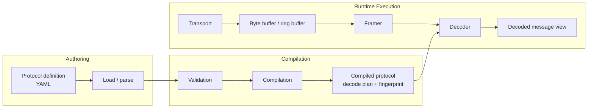
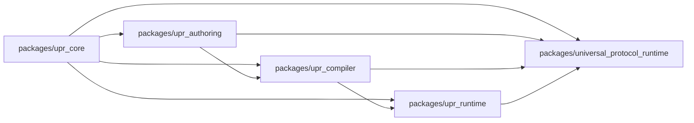

# Universal Protocol Runtime Design

Universal Protocol Runtime is built around a simple idea: protocol definitions should be easy to write, easy to validate, and cheap to execute. The architecture is split into authoring, compilation, and runtime execution.

That keeps the hot path small, predictable, and easier to reason about, while leaving room for richer tooling around schema authoring, discovery, replay, static integration, device adapters, and UI workflows.

## Design Goals

UPR is intended to serve binary streams required for performance-sensitive applications. The main goals are:

- Keep transport, framing, and message decoding independent so the same protocol can be reused across live streams, replay files, and tests.
- Compile protocol definitions into immutable runtime metadata instead of interpreting human-authored YAML on every message.
- Expose decoded data as borrowed views over the source bytes wherever possible.
- Make failure modes explicit, especially around framing errors, malformed payloads, and schema mismatches.
- Leave a clear path for replay, compatibility checks, adapters, discovery, and plugins without forcing those concerns into the hot path.
- Make discovery, adapter, and workbench features additive outer layers rather than cross-cutting rewrites.
- Keep code generation on the compiled-protocol boundary so static integrations never need to reach into runtime internals.

## Architecture

The runtime only needs two things to decode a message: a framed byte range and a compiled protocol description. Everything else belongs on the authoring side.

## Package Layout

The implementation is split into packages that match those layers:

- `packages/upr_core` contains schema-neutral primitives shared by every layer.
- `packages/upr_authoring` contains the protocol definition language and YAML loaders.
- `packages/upr_compiler` validates definitions and emits immutable compiled protocols.
- `packages/upr_runtime` contains framing, transport interfaces, decoding, and stream polling.
- `packages/upr_discovery` analyzes framed samples and emits conservative draft protocols.
- `packages/upr_adapters` provides concrete POSIX file-descriptor and socket transports.
- `packages/upr_codegen` generates static bindings from compiled protocols for C++ and Python.
- `packages/upr_workbench` renders a graphical HTML inspection surface over the other layers.
- `packages/universal_protocol_runtime` is a thin umbrella facade for consumers that want one dependency.

This split is the stable architectural center of the repository.

## Main Components

### Protocol definition

Protocols are described declaratively in YAML. A definition names messages and fields, including scalar widths, byte order, enums, strings, fixed-size and dynamic byte regions, nested structs, bitfields, checksums, and simple assertions such as `expect`.

The YAML format is deliberately author-friendly. It is not the runtime representation, and it lives entirely in `packages/upr_authoring`.

### Schema compiler

The compiler turns a protocol definition into an immutable compiled protocol. During that step it:

- validates message and field names
- validates field widths and layout rules
- resolves dynamic field dependencies
- records enough metadata for fast field lookup at runtime
- produces a stable schema fingerprint

The compiled protocol is the boundary between configuration and execution. It is owned by `packages/upr_compiler` and consumed by `packages/upr_runtime`.

### Code generation

Code generation is an outer layer that consumes compiled protocols and emits static integration artifacts. The layer in `packages/upr_codegen` generates C++ headers and Python modules.

That layer is intentionally compiler-adjacent rather than runtime-adjacent:

- inputs are immutable `CompiledProtocol` objects
- outputs are generated source artifacts, not live runtime objects
- static consumers get stable message names, field ids, bitfield ids, and metadata without repeated runtime string lookup
- generated C++ bindings emit a schema-specialized direct decode path for static flat layouts, resolving width, byte order, encoding, and fixed dispatch metadata at compile time while preserving zero-copy access for borrowed `bytes` and `string` fields and falling back to the generic runtime when the layout needs features outside that specialized path
- runtime byte-heavy helpers such as ASCII and UTF-8 validation plus built-in checksum passes use a private runtime backend that can dispatch to `simdutf`, `crc32c`, and Highway for large spans while preserving constexpr scalar helpers for compile-time specialization and fallback builds

This keeps language integration concerns out of the decode path while making static environments easy to support.

### Transport

Transports are responsible for getting bytes into the system. They do not know about message structure. The repository includes an in-memory replay transport in the runtime layer plus concrete POSIX file-descriptor and TCP socket transports in the adapters layer. UART, CAN, USB, or vendor SDK integrations fit behind the same interface.

### Framing

Framers turn a raw byte stream into message-sized slices. This stays separate from decoding so that the same message layout can be reused with different envelopes or delivery mechanisms.

The framing layer includes:

- fixed-size framing
- length-prefixed framing

### Decoder

The decoder walks a compiled message description against a framed byte span and resolves field offsets and lengths. It does not own the payload. If decoding succeeds, it returns a `DecodedMessage` that references the original bytes.

That keeps access cheap and avoids unnecessary materialization for the common case. Strings are exposed as validated borrowed `string_view`s, nested structs are exposed as nested borrowed views, and bitfields are read from scalar container fields rather than materialized separately. When a protocol uses fixed discriminator bytes such as a message type header, the compiled schema retains that leading expected prefix so `decode_any` can reject non-matching message shapes before attempting a full decode.

### Stream runtime

The stream runtime ties the pieces together. It reads from a transport into a bounded ring buffer, asks the framer for the next complete frame, and passes framed payloads to the decoder. If the readable region wraps, the runtime can linearize into scratch space as a bounded fallback rather than forcing every path to copy.

`poll()` is greedy by design. A single call can perform several transport reads if the source is immediately readable, which improves throughput and amortizes framing overhead. On decode failure it returns a `PollResult` with the exact `DecodeStatus`, the consumed frame size, and a caller-visible failure policy such as stop, drop-and-continue, or quarantine. For non-blocking transports, the intended usage is readiness-driven polling rather than repeatedly spinning on `kNeedMoreData`.

## Runtime Model

The runtime is designed around a small hot path:

1. Read bytes from a transport into a bounded buffer.
2. Ask the framer whether a complete frame is available.
3. Decode that frame against an immutable compiled schema.
4. Hand back a borrowed message view.

YAML parsing, schema validation, and compatibility decisions happen before that path starts.

## Performance Notes

The runtime is optimized first for predictable hot-path behavior:

- compiled schemas are immutable and reused across every decode
- field and message name lookups avoid allocation, while hot loops can resolve `FieldId` once and reuse it
- `decode_any` can prefilter messages by their compiled leading discriminator bytes when those bytes are explicit in the schema
- the ring buffer stays bounded, with scratch linearization only as a fallback when readable data wraps
- byte-heavy validation helpers keep scalar constexpr implementations for generated compile-time specialization and use runtime-dispatched `simdutf`, `crc32c`, and Highway-backed paths for large spans on supported targets

The runtime structure also accommodates further transport and framing refinements, including two-span framing paths that avoid copying wrapped readable regions just to inspect a frame boundary.

## Core Feature Set

The core layers support:

- YAML protocol loading
- schema compilation and validation
- fingerprinted compiled protocol metadata
- decoding of fixed-width scalars, enums, strings, fixed bytes, and dynamic byte fields
- nested structs
- bitfield views over scalar containers
- compiled checksum verification
- fixed-size and length-prefixed framing
- ring-buffer-backed stream polling
- an in-memory replay transport

These capabilities establish the main API boundaries for authoring, compilation, and runtime execution.

## Outer Layers

### Automatic protocol discovery

Protocol discovery is a conservative authoring accelerator in `packages/upr_discovery`.

- inputs: framed byte samples
- clustering: sample frames are grouped by discriminator byte and common leading prefix
- inference: the engine recognizes fixed prefixes, fixed-size regions, simple ASCII spans, and common length-prefixed payload patterns
- outputs: a `DiscoveryReport` plus a compileable draft `ProtocolDefinition`

The important boundary is that discovery emits authoring artifacts. It does not change runtime decode behavior.

### Broad hardware adapter coverage

The adapter layer in `packages/upr_adapters` provides concrete POSIX integrations.

- `PosixFdTransport` reads from real file descriptors and device files
- `PosixSocketTransport` reads from connected sockets and can connect TCP clients directly
- both adapters expose readiness waiting so they fit non-blocking runtime loops

This provides hardware and socket coverage without coupling platform details to the runtime core.

### Graphical workbench

The workbench in `packages/upr_workbench` is a self-contained HTML renderer.

- it presents authoring definitions, compiled protocol metadata, discovery reports, and sample frames in one view
- it is easy to write to disk and review locally, without introducing a frontend toolchain into the repository
- it stays strictly outside runtime execution

## Extension Seams

The architecture accommodates deeper coverage and broader tooling without changing the core split:

- capture and replay formats that feed authoring, discovery, and workbench workflows without changing runtime decode semantics
- richer compiler-side schema assertions and compatibility checks at the configuration boundary
- broader device and socket transports on top of the runtime transport interface
- additional code-generation targets alongside C++ and Python
- deeper discovery heuristics such as field segmentation, checksum inference, and replay-assisted clustering
- richer workbench workflows for editing, live capture, replay, and generated-binding inspection

The core split between authoring, compilation, and runtime execution stays unchanged while those capabilities extend outward.
