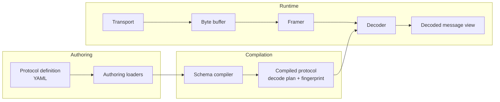

# Universal Protocol Runtime

Universal Protocol Runtime (UPR) is a C++20 library for defining binary protocols once and running them against live or replayed byte streams. It is designed for systems that care about predictable latency, explicit protocol control, and a clean separation between authoring, compilation, runtime execution, and outer tooling.

UPR sits between packet inspection tools and schema-first serializers. It keeps the protocol description explicit, compiles that description into an immutable decode plan, and exposes decoded messages as borrowed views over the original bytes.

## What UPR Provides

- A YAML-based protocol definition language for binary message layouts
- A schema compiler that validates definitions and produces immutable compiled protocols
- Heuristic automatic protocol discovery that emits compileable draft schemas from sampled frames
- Real POSIX file-descriptor and TCP socket transports for live devices and networks
- Generated C++ headers and Python modules for static schema bindings
- A self-contained graphical HTML workbench for protocol inspection and discovery review
- Fixed-size and length-prefixed framing
- Borrowed decoded message views with zero-copy field access on the hot path
- Bitfields compiled as views over scalar container fields
- Compiled checksum verification with built-in algorithms and vendor extension hooks
- Borrowed string views for validated ASCII and UTF-8 fields
- Reusable nested structs inside top-level messages
- A bounded ring-buffer runtime for polling streams
- A transport abstraction with a bundled in-memory replay transport for tests, replay, and offline runs

## Architecture



The repository now mirrors that split directly:

- `packages/upr_core/` holds shared schema-neutral types.
- `packages/upr_authoring/` owns the protocol definition language and YAML loading.
- `packages/upr_compiler/` validates definitions and produces immutable compiled protocols.
- `packages/upr_runtime/` handles framing, transport, decoding, and stream polling.
- `packages/upr_discovery/` turns sample frames into conservative draft protocol definitions.
- `packages/upr_adapters/` provides concrete POSIX file-descriptor and socket transports.
- `packages/upr_codegen/` generates C++ and Python schema bindings from compiled protocols.
- `packages/upr_workbench/` renders a graphical HTML workbench for inspection and review.
- `packages/universal_protocol_runtime/` is the umbrella facade that re-exports the layered packages.

Once the runtime is active, it only deals with bytes, framing, compiled schema metadata, and borrowed views.

## Current Scope

The current repository covers the core authoring and runtime path:

- Fixed-width unsigned, signed, floating-point, enum, `bytes`, and `string` fields
- Dynamic `bytes` and `string` fields sized by an earlier field
- Field-level constant assertions with `expect`
- Reusable nested `structs`
- Scalar-backed bitfields
- Built-in checksum validation for `crc16_ccitt`, `crc32`, `crc32c`, `xor8`, and `sum16`
- Schema fingerprinting and validation during compilation
- Message decoding by compiled schema
- Heuristic protocol discovery with cluster reports and compileable draft output
- POSIX file-descriptor, socket-pair, and TCP client transports
- Generated C++ schema headers and Python schema modules from compiled protocol metadata
- HTML workbench rendering for authoring, compiled metadata, discovery results, and captured frames
- Stream polling over a bounded ring buffer with explicit decode-error policy reporting

The bundled runtime still includes the in-memory replay transport, and the adapters package now adds real POSIX file-descriptor and TCP socket transports behind the same `ITransport` interface.

## Future Additions

The remaining next capabilities are still intentionally outside the core authoring -> compilation -> runtime path:

- deeper protocol discovery heuristics such as checksum guessing, field segmentation, and replay-assisted clustering
- broader hardware adapter coverage such as serial, CAN, USB, and vendor SDK integrations on top of the runtime transport abstraction
- richer workbench editing, replay, and live-stream workflows on top of the current HTML report generator

Generated bindings, discovery, real adapters, and the workbench all sit outside the runtime hot path and therefore do not change the fundamental split.

## Example Protocol

```yaml
protocol: market_data
messages:
  - name: Order
    fields:
      - name: message_type
        type: uint8
        expect: 1
      - name: header
        type: uint16_be
        bits:
          - name: version
            offset: 13
            width: 3
          - name: urgent
            offset: 12
            width: 1
      - name: price
        type: float32_le
      - name: quantity
        type: uint32_le
      - name: side
        type: enum
        underlying: uint8
        values:
          1: Buy
          2: Sell
```

## Example Usage

```cpp
namespace upr = universal_protocol_runtime;

const auto definition = upr::load_protocol_definition_from_yaml(yaml_text);
const auto compiled = upr::compile_protocol(definition.value());

upr::ProtocolDecoder decoder(compiled.value());
const upr::CompiledMessage* order = compiled.value().find_message("Order");
const upr::FieldId price_id = order->find_field("price").value();
const upr::FieldId quantity_id = order->find_field("quantity").value();
const upr::BitFieldId version_id = order->find_bit_field("version").value();

upr::DecodedMessage message;
const upr::DecodeStatus status =
    decoder.decode_as("Order", upr::ByteSpan(frame.data(), frame.size()), &message);
if (status == upr::DecodeStatus::kOk) {
  const float price = message.get<float>(price_id).value();
  const uint32_t quantity = message.get<uint32_t>(quantity_id).value();
  const uint8_t version = message.get_bit<uint8_t>(version_id).value();
}
```

For streaming inputs:

```cpp
upr::SpanTransport transport(byte_stream, 0);
upr::LengthPrefixedFramer framer({.prefix_width_bytes = 2});
upr::StreamRuntime<4096> runtime(transport, framer, decoder);

upr::DecodedMessage message;
for (;;) {
  const upr::PollResult result = runtime.poll(&message);
  if (result.status == upr::PollStatus::kMessageReady) {
    handle(message);
    continue;
  }
  if (result.status == upr::PollStatus::kNeedMoreData) {
    wait_for_transport_readiness();  // epoll/select/serial event
    continue;
  }
  if (result.status == upr::PollStatus::kDecodeError &&
      result.policy == upr::DecodeFailurePolicy::kDropAndContinue) {
    continue;
  }
  break;
}
```

`poll()` is intentionally greedy: it keeps reading until it decodes a frame, hits a blocking boundary, reaches end-of-stream, or sees an error. On decode failure it returns the exact `DecodeStatus`, the frame bytes consumed, and the configured policy for that class of failure. For low-overhead hot loops, resolve `FieldId` and `BitFieldId` once and prefer id-based access over repeated string lookup.

String fields are already zero-copy. `get_string_view()` borrows directly from the framed byte span, so copying into `std::array<char, N>` would usually be slower. If a caller wants a fixed-extent borrowed view for a known-width field, use `get_fixed_string<N>()` or `get_fixed_bytes<N>()`.

## Build

```bash
bazel build //...
bazel test //...
bazel run //examples:upr_demo
```

To generate bindings in your own tooling, depend on `//packages/upr_codegen` and call `generate_cpp_bindings_header()` or `generate_python_bindings_module()` with a `CompiledProtocol`.

For discovery and the workbench, use `discover_protocol_from_samples()` from `//packages/upr_discovery` and `render_workbench_html()` or `write_workbench_html_file()` from `//packages/upr_workbench`.

## Repository Layout

- `packages/upr_core/`, `packages/upr_authoring/`, `packages/upr_compiler/`, and `packages/upr_runtime/` contain the layered implementation.
- `packages/upr_discovery/`, `packages/upr_adapters/`, `packages/upr_codegen/`, and `packages/upr_workbench/` contain the outer tooling and integration layers.
- `packages/upr_codegen/` contains generated binding support for C++ and Python.
- `packages/universal_protocol_runtime/` provides the umbrella public facade.
- `examples/` contains a small end-to-end demo.
- `packages/utils/` contains shared utility types used across the repository.
- `tools/` and `scripts/` provide the Bazel, clang-tidy, and CI helpers used across the repository.

## Further Reading

The design notes in [DESIGN.md](DESIGN.md) explain the architectural boundaries, runtime model, and intended direction of the project.
